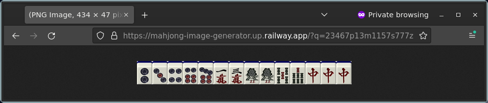

# mahjong-image-generator

Generates an image of a mahjong hand represented using ["MPSZ algebraic notation"](https://www.reddit.com/r/Mahjong/comments/dgth5z/comment/f3ehlk9/?utm_source=share&utm_medium=web2x&context=3).



## Try it out!

https://mahjong-image-generator.onrender.com/?q=23467p13m1157s777z

## Built with
- [Flask](https://flask.palletsprojects.com/)
- [Pillow](https://python-pillow.org/)
- [Waitress](https://github.com/Pylons/waitress)

## Setting up locally

Clone the repo and in the folder, run:
```
docker build -t mahjong-image-generator .
docker run -p 5000:5000 -it mahjong-image-generator
```

The app will be available on [`http://localhost:5000`](http://localhost:5000).

## Acknowledgments

- Tile images are taken from https://tenhou.net/2/.
